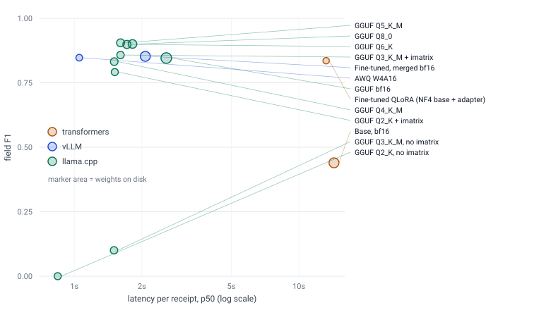

# receipt-vlm

Fine-tuning and quantizing a small vision-language model to read receipts, and measuring what each step
actually costs.

A receipt photo goes in; the fields come out as JSON — menu items with counts and prices, subtotal, tax,
total, payment. The model is **Qwen2.5-VL-3B-Instruct**, fine-tuned with QLoRA on
[CORD v2](https://huggingface.co/datasets/naver-clova-ix/cord-v2) and quantized four different ways.

Everything below is measured on a held-out test split of 100 receipts, scored once. Differences are paired
bootstrap comparisons over the same receipts; a difference is called **real** only when its 95% interval
excludes zero.

## Results

| | Test field F1 | Weights | Latency p50 | Output tok/s |
|---|---|---|---|---|
| Base model, zero-shot | 0.440 | 7.16 GiB | 14.33 s | 24.2 |
| **Fine-tuned (QLoRA r16)** | **0.836** | — | 13.22 s | 7.8 |
| Fine-tuned, merged bf16, on vLLM | 0.852 | 7.16 GiB | 2.07 s | 51.1 |
| **AWQ W4A16, on vLLM** | **0.847** | **3.31 GiB** | **1.05 s** | **103.1** |
| GGUF bf16, on llama.cpp | 0.846 | 8.24 GiB | 2.57 s | 41.4 |
| **GGUF Q4_K_M, on llama.cpp** | **0.832** | 4.28 GiB | 1.51 s | 75.4 |
| GGUF Q2_K + imatrix | 0.791 | 3.67 GiB | 1.51 s | 76.8 |

Fine-tuning nearly doubles field F1: **0.440 → 0.836**, a paired gain of **+0.396 [+0.345, +0.442]**.

Full tables, every bit width and all the paired comparisons: **[docs/tradeoffs.md](docs/tradeoffs.md)**.



## Four things worth knowing

**1. Quantizing to 4 bits is close to free.** On test, AWQ W4A16 differs from the bf16 model it was built
from by −0.005 [−0.026, +0.013], and GGUF Q4_K_M from its own bf16 reference by −0.014 [−0.038, +0.009].
Neither is real. Both are roughly half the size and substantially faster.

**2. The runtime matters more than the bit width.** The same fine-tuned weights take **13.22 s** per receipt
in transformers and **1.05 s** as AWQ on vLLM. That gap is larger than the entire spread across every GGUF
bit width tested. Picking the serving stack was a bigger decision than picking the precision.

**3. The model reads receipts well and misfiles what it reads.** All 100 test receipts produced valid JSON —
no format failures at all. The worst receipt has every value correct and the keys wrong. The second worst
reads all eight items correctly, then nests six of them under item three. See
**[docs/failure_taxonomy.md](docs/failure_taxonomy.md)**:

| What went wrong | Receipts |
|---|---|
| Exactly correct | 41% |
| Digit difference | 16% |
| Separator or whitespace only | 15% |
| Nesting error | 9% |
| Invalid JSON or truncated | **0%** |

So the remaining headroom is structural, not perceptual — which points at schema-aware or constrained
decoding rather than more training data.

**4. The expectation going in was wrong.** This project set out to find whether 4-bit quantization hurts
*digits* before *text*. It does not. Down to 4 bits nothing degrades measurably at all; below 4 bits
everything degrades together. The one place digits stand out is at 2–3 bits, where numeric F1 falls while
overall F1 is still within noise.

## Two bugs that produced convincing wrong answers

Both were caught by checking a result that looked too dramatic, and both are worth reading if you work with
quantized VLMs:

**The vision projector must be f32.** Built at f16, llama.cpp emitted floods of `!` tokens on particular
receipts — content-dependent, deterministic, and completely silent in the server logs. f16 saturates at
65504; the projector runs in bf16 everywhere else, so only the GGUF path overflowed into NaN. Field F1
0.540 with 60% truncation at f16; 0.899 at f32, same weights. The projector cannot be quantized, so it is a
fixed 2.49 GiB on every GGUF row — which is why no GGUF bit width undercuts AWQ's 3.31 GiB on disk.

**K-quants below Q4 need an importance matrix.** Without one, Q3_K_M scored 0.100 and Q2_K emitted a median
of three tokens. That looked like a dramatic bit-width cliff, and it was reported as one before being
tested. It was not: `llama-imatrix` had never been built, so `make_gguf.sh` could only produce uncalibrated
K-quants. With a matrix built from the training receipts, Q3_K_M scores 0.858 and Q2_K 0.876. Both the
uncalibrated and calibrated rows are kept in the tables, because the difference between them is the finding.

## Method

- **Splits.** CORD's `validation` is the dev split used for every choice: prompt, image cap, LoRA rank,
  learning rate, checkpoint, bit width. Test was scored only for final variants. 28 cross-split duplicate
  images were found by perceptual hash and dropped, leaving 773 / 99 / 100.
- **Scoring.** Field-level F1 over flattened `(key path, value)` pairs, following Donut's CORD evaluation so
  the numbers can be read next to published ones, plus JSON validity, receipt exact match and tree-edit
  accuracy. Reported overall, on numeric keys and on text keys.
- **Uncertainty.** Percentile bootstrap over receipts, 2,000 resamples, and paired differences between
  variants on the same receipts.
- **Ablations.** Learning rate, LoRA rank, language-model layers vs. also the vision projector, QLoRA vs.
  bf16 LoRA, and partial full fine-tuning — all on dev: **[docs/ablations.md](docs/ablations.md)**.

## Running it

Code is written locally and runs on a remote GPU (RTX 5060 Ti, 16 GB) through the `./gpu` helper
(`./gpu push`, `./gpu run`, `./gpu status`, `./gpu pull`), which wraps `rsync`, `ssh` and `tmux`.

```bash
make setup   # local venv, light dependencies
make check   # ruff + 89 unit tests, CPU only, no model downloads
```

Serving the quantized model — one receipt in, its fields out, with a per-request readout of latency and
tokens:

```bash
pip install -e ".[serve]"
uvicorn "receipt_vlm.serve.api:default_app" --factory --port 8000
curl -X POST localhost:8000/extract -F "file=@receipt.png;type=image/png"
```

or in a container, with the weights mounted rather than baked in:

```bash
docker build -t receipt-vlm .
docker run --gpus all -p 8000:8000 -v /path/to/awq-checkpoint:/models/awq:ro receipt-vlm
```

There is no hosted demo. `python -m receipt_vlm.serve.gradio_app` runs one locally.

## Repository

```
src/receipt_vlm/
  data/     CORD → normalized examples, splits, leakage check
  eval/     field F1, TED, bootstrap, paired comparisons
  infer/    transformers, vLLM and llama.cpp backends behind one interface
  train/    QLoRA trainer and the ablation sweep
  quant/    adapter merge and AWQ
  serve/    FastAPI endpoint and Gradio demo
docs/       tradeoffs, failure taxonomy, ablations
outputs/runs/<run_id>/   every run's config, summary and report
```

Data (CC BY 4.0): CORD v2, Park et al., *CORD: A Consolidated Receipt Dataset for Post-OCR Parsing*, 2019.
Base model: Qwen2.5-VL-3B-Instruct.
