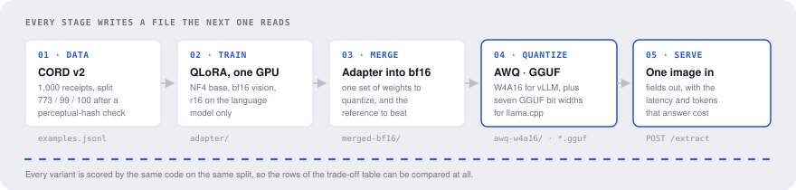

<p align="center">
  
</p>

<h1 align="center">receipt-vlm</h1>

<p align="center">
  <b>Photograph a till receipt. Get its fields back as JSON — every item, count, price, tax and total.</b><br>
  A 3B vision-language model fine-tuned on one consumer GPU, quantized four ways, and measured at every step.
</p>

<p align="center">
  <a href="https://mazenddr.github.io/receipt-vlm/"><b>Field guide</b></a> (every part explained, with animations)
  &nbsp;·&nbsp;
  <a href="https://mazenddr.github.io/receipt-vlm/tour/"><b>The tour</b></a> (one receipt, start to finish)
  &nbsp;·&nbsp;
  <a href="https://mazenddr.github.io/receipt-vlm/demo/"><b>See it work</b></a> (100 recorded extractions)
  &nbsp;·&nbsp;
  <a href="docs/blog.md"><b>The story</b></a> (two bugs that looked like findings)
</p>

---

## Results at a glance

| | |
|---|---|
| **Fine-tuning** | Field F1 on 100 held-out receipts: **0.440 → 0.836**, a paired gain of **+0.396 [+0.345, +0.442]**. 39 receipts come back exactly right; 28 that the base model failed are now correct. |
| **Quantization** | 4-bit is **free**: AWQ W4A16 differs from its bf16 source by −0.005 [−0.026, +0.013], GGUF Q4_K_M from its own reference by −0.014 [−0.038, +0.009]. Neither is real. |
| **Speed** | The **runtime** matters more than the bit width: the same weights take **13.22 s** per receipt in transformers and **1.05 s** as AWQ on vLLM — a bigger gap than every GGUF bit width combined. |
| **Errors** | **0 of 100** outputs were invalid JSON. The worst receipt has every value correct and every key wrong: the model reads receipts well and misfiles what it reads. |
| **Cost** | **$0.** Open weights throughout — Qwen2.5-VL-3B-Instruct on one RTX 5060 Ti, 16 GB. |

## How it works

<p align="center"></p>

1. **Data.** [CORD v2](https://huggingface.co/datasets/naver-clova-ix/cord-v2): 1,000 photographed receipts labelled as JSON. Every image is hashed perceptually across splits first — **28 near-duplicates appeared in more than one split** and were dropped, leaving 773 / 99 / 100. [→ guide](https://mazenddr.github.io/receipt-vlm/#data)
2. **Fine-tune.** QLoRA: NF4 base, vision tower in bf16, LoRA on the language model only, loss on answer tokens alone. Fits in 16 GB. [→ guide](https://mazenddr.github.io/receipt-vlm/#train)
3. **Merge.** The adapter folds into bf16 — one set of weights to quantize, and the reference every quantized row is measured against. [→ guide](https://mazenddr.github.io/receipt-vlm/#quantize)
4. **Quantize.** AWQ W4A16 for vLLM, and seven GGUF bit widths for llama.cpp. [→ guide](https://mazenddr.github.io/receipt-vlm/#quantize)
5. **Serve.** `POST /extract` returns the fields plus the latency, tokens and throughput that answer cost. The runtime is config, not code. [→ guide](https://mazenddr.github.io/receipt-vlm/#serve)

## What the experiments found

### Fine-tuning is the only change that moves accuracy much

<p align="center"></p>

Every comparison here is paired over the same receipts with a 95% bootstrap interval, and counts as real only when that interval excludes zero. Most things I tried were not real: rank 8 and rank 32 both scored below rank 16, adapting the vision projector as well scored 0.867 against 0.900, and partial fine-tuning of the last four layers reached 0.817. Full table: [`docs/ablations.md`](docs/ablations.md).

### Four bits costs nothing. Below four, it depends on calibration.

<p align="center"></p>

Everything from Q8_0 down to Q4_K_M sits within noise of bf16 **and is faster**. The drop at Q3 and Q2 looked like a clean bit-width cliff, and I wrote it up as one — before testing it. It was not: our own build script never compiled `llama-imatrix`, so those rows were quantized without calibration. With an importance matrix built from the training receipts they recover to 0.858 and 0.876.

On the test split, though, Q2_K+imatrix does fall behind for real (−0.054 [−0.092, −0.020]) — the dev tie did not survive. **Q4_K_M is the row to ship.** Full table and every paired comparison: [`docs/tradeoffs.md`](docs/tradeoffs.md).

### The vision projector cannot be quantized, and must not be f16

<p align="center"></p>

Built at f16 it overflows into NaN on particular receipts and the model emits `!` until it hits the token cap — content-dependent, deterministic, and silent, with the server reporting normal throughput throughout. Four other explanations were tested and ruled out before this one was found. At f32 it is a fixed **2.49 GiB** on every GGUF row, which is why no GGUF build undercuts the AWQ checkpoint's 3.31 GiB on disk.

### The model reads receipts well and misfiles what it reads

<p align="center"></p>

Reading the twenty worst receipts against their photographs, then counting every pattern found that way across the whole dev split, gives a different picture from the aggregate. Separator conventions alone account for about a third of the numeric gap — strict numeric F1 0.866 against 0.910 lenient. The remaining headroom is **structural, not perceptual**, which points at constrained decoding rather than more data. Details: [`docs/failure_taxonomy.md`](docs/failure_taxonomy.md) and [`docs/annotation_guidelines.md`](docs/annotation_guidelines.md).

## Weights

On the Hugging Face Hub. Pick by how you want to run it:

| | Size | For |
|---|---|---|
| [**LoRA adapter**](https://huggingface.co/mazenDDr/receipt-vlm-qwen2.5-vl-3b-lora) | 119 MB | applying to the base model yourself, or re-quantizing |
| [**AWQ W4A16**](https://huggingface.co/mazenDDr/receipt-vlm-qwen2.5-vl-3b-awq) | 3.4 GB | serving on a GPU with vLLM — **the recommended build** |
| [**GGUF Q4_K_M**](https://huggingface.co/mazenDDr/receipt-vlm-qwen2.5-vl-3b-GGUF) | 4.3 GB | llama.cpp |

```python
# the adapter, on top of the base model
from peft import PeftModel

model = PeftModel.from_pretrained(base, "mazenDDr/receipt-vlm-qwen2.5-vl-3b-lora")
```

```bash
# the 4-bit build, served
vllm serve mazenDDr/receipt-vlm-qwen2.5-vl-3b-awq --max-model-len 4096
```

**If you use the GGUF build, take both files** — `model-Q4_K_M.gguf` *and* `mmproj-f32.gguf`. The projector
must be f32: at f16 it overflows into NaN on particular receipts and the model then emits `!` until it
hits the token cap, silently. That is why no f16 projector is published, and why `Q3_K_M` and `Q2_K` are
not either — without an importance matrix they collapse to field F1 0.100 and 0.000.

## Try it

**Instantly, in the browser:** [100 recorded extractions](https://mazenddr.github.io/receipt-vlm/demo/) — every held-out receipt with what the base model, the fine-tuned model and both 4-bit builds returned, field by field against the labels, filterable by what went wrong. Nothing runs a model, so it is free and immediate.

**Locally**, one receipt in and its fields out:

```bash
pip install -e ".[serve]"
uvicorn "receipt_vlm.serve.api:default_app" --factory --port 8000
curl -X POST localhost:8000/extract -F "file=@receipt.png;type=image/png"
```

or in a container, with the weights mounted rather than baked in:

```bash
docker build -t receipt-vlm .
docker run --gpus all -p 8000:8000 -v /path/to/awq-checkpoint:/models/awq:ro receipt-vlm
```

There is no hosted demo: a free CPU tier would serve a 3B vision model at a few tokens per second, which would misrepresent something that runs at 103 tok/s on a GPU.

## Method

- **Splits.** Every choice — prompt, image cap, LoRA rank, learning rate, checkpoint, bit width — was made on dev. Test was scored once, for final variants only.
- **Scoring.** Field-level F1 over flattened `(key path, value)` pairs following Donut's CORD evaluation, so the numbers sit alongside published ones, plus JSON validity, receipt exact match and tree-edit accuracy. Reported overall, on numeric keys and on text keys.
- **Uncertainty.** Percentile bootstrap over receipts, 2,000 resamples; differences between variants are paired on the same receipts.
- **Reproducibility.** Every page and document is generated from the committed runs by `scripts/tradeoffs_doc.py` and `scripts/build_site.py`. No number is typed in by hand.

## Repository

```
src/receipt_vlm/
  data/     CORD → normalized examples, splits, leakage check
  eval/     field F1, TED, bootstrap, paired comparisons
  infer/    transformers, vLLM and llama.cpp behind one interface
  train/    QLoRA trainer and the ablation sweep
  quant/    adapter merge and AWQ
  serve/    FastAPI endpoint and Gradio demo
docs/       trade-offs, failure taxonomy, annotation guidelines, ablations, the story
site/       the field guide, the tour and the recorded extractions
outputs/runs/<run_id>/   every run's config, summary and report
```

```bash
make setup   # local venv, light dependencies
make check   # ruff + 89 unit tests, CPU only, no model downloads
```

## Credits

Receipts from [CORD v2](https://huggingface.co/datasets/naver-clova-ix/cord-v2) (Park et al., *CORD: A Consolidated Receipt Dataset for Post-OCR Parsing*, 2019), CC BY 4.0.
Base model [Qwen2.5-VL-3B-Instruct](https://huggingface.co/Qwen/Qwen2.5-VL-3B-Instruct).
Quantization with [llm-compressor](https://github.com/vllm-project/llm-compressor) and [llama.cpp](https://github.com/ggerganov/llama.cpp); serving with [vLLM](https://github.com/vllm-project/vllm).

Licensed under the [MIT License](LICENSE).
